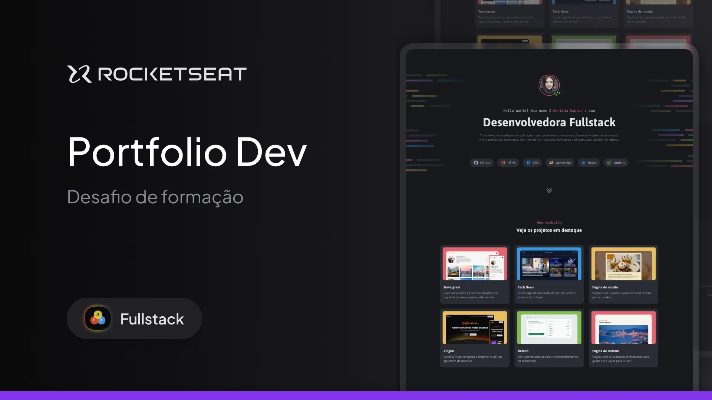

# Portfólio Dev 👩‍💻
Este repositório contém a solução para o desafio prático "Portfólio Dev" da Formação Fullstack da Rocketseat, que consiste no desenvolvimento de um portfólio para desenvolvedores.



## Tecnologias Utilizadas

- **Frontend:** HTML e CSS


## Protótipo

O design do projeto pode ser acessado através do link: [Portfólio Dev - Figma](https://www.figma.com/community/file/1387080701963671866/portfolio-dev).


## Funcionalidades

- Criação de layouts com CSS;
- Posicionamento de elementos;
- Uso de CSS Flexbox e CSS Grid;
- Utilização de variáveis CSS;
- Aplicação de pseudo-classes e pseudo-elementos.

## Considerações
O desafio não envolvia a necessidade de trabalhar a responsividade do projeto.

## Como Rodar o Projeto

1. Clone o repositório:
   ```sh
   git clone https://github.com/biancaramal/portfolio-dev-rocketseat.git
   cd portfolio-dev-rocketseat
   ```
2. Abra o arquivo `index.html` em seu navegador.

## Licença

Este projeto foi desenvolvido no módulo "Avançando no HTML e CSS" da [Formação Full Stack](https://www.rocketseat.com.br/formacao/fullstack) da Rocketseat